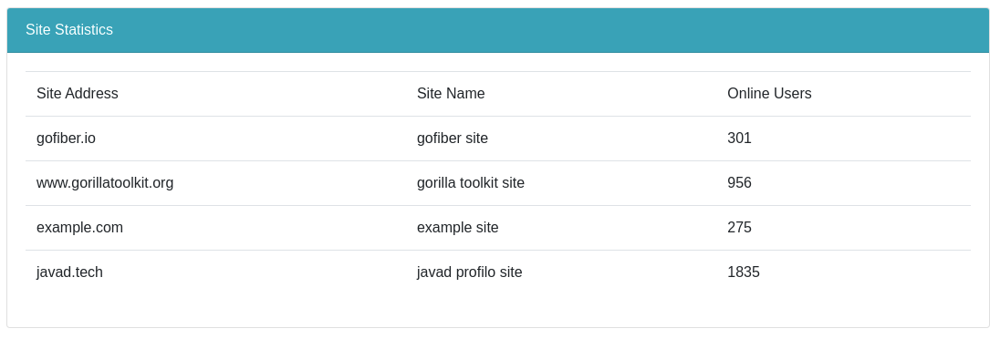

# Count online users in real-time with Gorilla Websocket

This is the implementation of a real-time site for tracking users online via websocket

## How to run?
1. install go modules `go mod -x download`
2. run server `go run ./server/server.go ./server/hub.go`
3. open client `index.html`